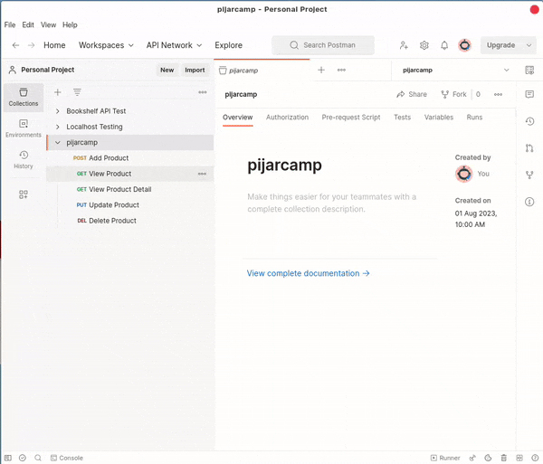

# Hallo Selamat datang
ini adalah imlementasi NodeJs.  
dibawah ini adalah dokumentasi testing api saya.



## Author
Rizqi Pratama (@RizqiKazuKun)

## Repo
https://github.com/rizqikazukun/Backend-Hapi-Sequelize

## Tech Stack
- NodeJs
- Hapi Web Framework
- Squelize (Database ORM)

## Runtime Dependency
- node
- pm2 https://pm2.keymetrics.io

## Cara Menjalankannya

```npm instll```  
```pm2 start ./src/index.js --name backend```  

## Konfigurasi
Lakukan Konfigurasi Environment pada patform  
Sesuaikan Konfigurasi sesuai kebutuhan

```shell
# For Development Purpose (Pijarcamp)
SQL_HOST=localhost;
SQL_PORT=3306;
SQL_DB="pijarcamp";
SQL_USERNAME=root;
SQL_PASSWORD="";

# Backend Configuration
APP_BE_HOST=localhost;
APP_BE_PORT=3000;
```
